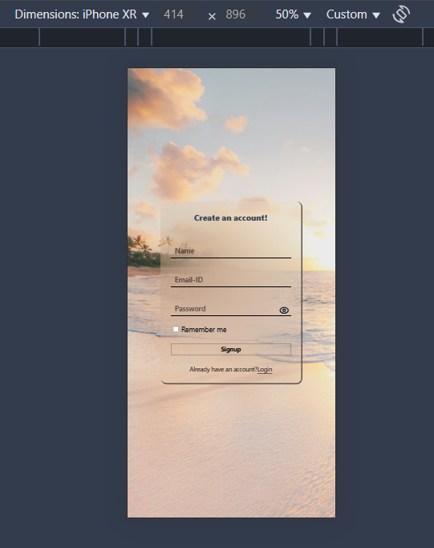
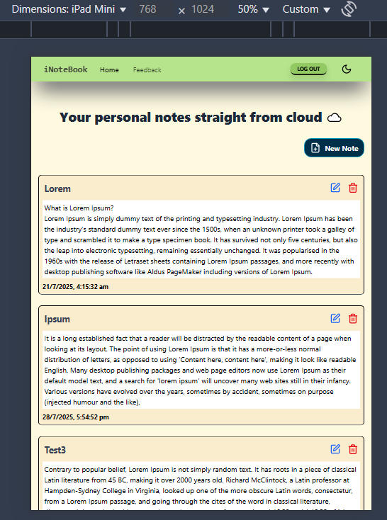
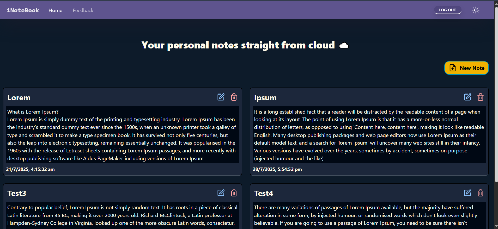

# iNoteBook
Update: check out the live app [here](https://i-note-book-two.vercel.app) 🚀
---

### 🧰 Tech Stack
- 
- 
- 
- 
- 
- 
- 
---

### ⚙️ Setup
1) Installation:
   - `git clone https://github.com/Priyanshu1-62/iNoteBook.git`
   - `cd iNoteBook`
   - `npm install`
2) Environment Variables:  
   Create a .env file in the project root with (Update the port if your backend runs on a different one):
   - `VITE_BACKEND_URL=http://localhost:5000`
3) Backend Setup:
   - Follow setup steps in [iNoteBook Backend](https://github.com/Priyanshu1-62/iNoteBook-Server.git) repo.
4) Run Frontend:
   - `npm run dev`
---

1) git clone https://github.com/Priyanshu1-62/iNoteBook.git
2) cd iNoteBook
3) npm install

### 🗺️ Overview
- iNoteBook is a fully responsive, Vite powered MERN-stack project designed to be your everyday companion for jotting down insights, to recollect inspirations and Eureka moments, or to preserve hot teas for future gossips !!
- __💅 Styling and UX:__ Tailwind CSS, a utility-first framework, is used for designing responsive, mobile-friendly layouts. Other notable features include:
  - Fully integrated dark theme
  - Minimalist, clean and uncluttered UI
  - Alert and Loading spinner system
  - Smooth transitions
  - Visual process feedback
- __🧱 Structure and Security:__
  - The project follows modular file structure, organized React-components, maintainable and scalable flow of state variables using Context-API, thoughtful user interactions and lucid icons.
  - For authorized access to protected resources and protection against XSS attacks, a system of JSON web-tokens (JWTs) is used. User input is sanitized and validated before further processing.
---

  
  

### 🧠 State Management
- The project required certain vaiables to be accessible across all React-components. While this can be technically achieved by prop drilling, it would lead to cluttered folder structure and reduced scalability. It would be combursome to add a few more such global variables and functions.
- To tacle this, context API is used. Based on the responsibilities, 3 context providers are created - for Authorization, Notes management, Alert management. These contexts envelpoes rest of the app tree to make the necessary variables and functions easily accessible throughout the app.
- The state variables are responsible for authorized entry, restricted notes manipulation, loading spinner management, and to show visually informative Alerts.
---

### 📡 API Integration and Routing
- Fetch-API is used for all Client-to-server communication. Authentication and authorization management routing funcitons include: Signup, Login, Remember me, Logout, Refreshing the session token. Notes management routing functions include: Create, Read, Update, Delete (CRUD) notes.
- To handle expired sessions seamlessly, without need of Logout and re-Login, a refresh mechanism is used in notes management routing functions. This mechanism catches server response status before updating user interface. If the status implies "Session expired", then it tries to renew the session and retries the original request.
- Dynamic routing is incoorporated to include Notes ID into route params for Updating and Deleting notes.
- All routes include structured response handling with consistent and clear Alert messeges for meaningful UI feedback.
- Session tokens are stored in Local storage to persist user sessions across page reloads. The token is later retrived and integrated in request body by routing functions. Since data in local storage is vulnerable to XSS attacks, a system of access and refresh token is used. Access tokens are responsible for authorization and have short life-span, thus reducing the damange window if stolen. Refresh tokens, with longer validity period, are responsible for renewing access tokens periodically and are securely kept in HTTP-only cookies. Read more about it in Authentication and Security section present in [Backend repository](https://github.com/Priyanshu1-62/iNoteBook-Server.git) of this project.
---

### 🪝 React Hooks
 Here is a list of React hooks and their respective roles in the project:
 - __useState:__  Manages component-level state and triggers re-render in response to user interactions.
 - __useEffeect:__ Its first major application is to handle user's manual page refresh. Second major role is to load and delete necessary Notes on relevent renders.
 - __useLocation:__ Helps in conditionally rendering components such as Navbar based on current route.
 - __useNavigate:__ To redirect user on actions such as Signup, Login, Logout.
 - __useContext:__ Used in Context API for make certain variables and functiions available across multiple components.
 - __useRef:__ To create variables that retain their values between renders, like state variables, but does not trigger re-render on value update, like normal variable. In this project, it is used to store DOM references and IDs.
---

### 🌍 Deployment
- Frontend: [Vercel](https://i-note-book-two.vercel.app)
- Backend: [Render](https://inotebook-server-8i8l.onrender.com)
---

### 📎 Related Repositories
- Frontend: [iNoteBook Backend](https://github.com/Priyanshu1-62/iNoteBook-Server.git)
---

## 📛 Badges Credit
- [shields.io](https://shields.io) for dynamic badge generation  
- [inttter/md-badges](https://github.com/inttter/md-badges) for curated badge styles and inspirations

